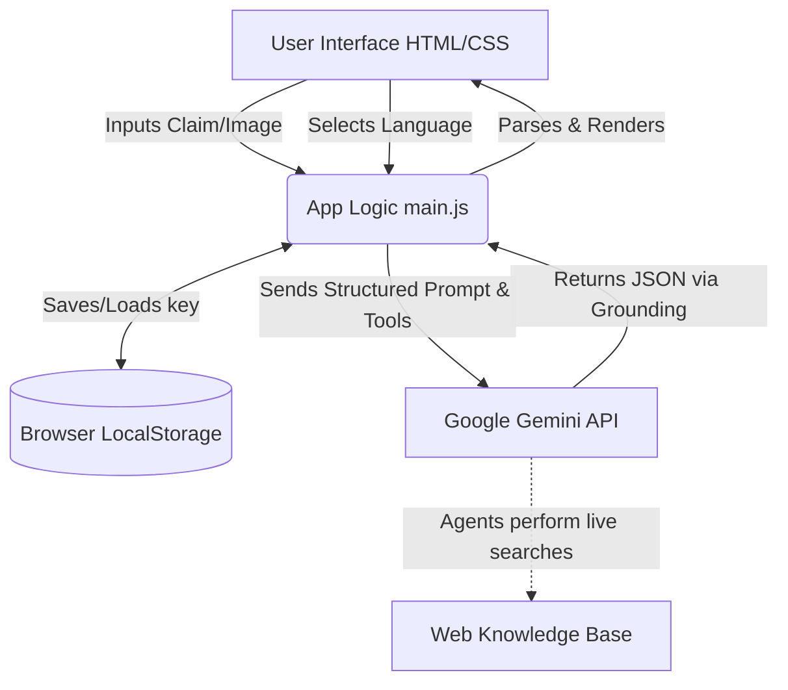

# TruthLens AI

TruthLens AI is an intelligent, client-side fact-checking assistant designed to help users evaluate the credibility of news, claims, and information. Leveraging Google's generative AI with Agentic Search capabilities, it investigates text claims and images directly from the browser, identifying red flags, providing logical reasoning, and returning verifiable sources.

## Features

- **Multi-modal Fact-Checking**: Paste news snippets, write claims, or upload images (screenshots/memes) for immediate evaluation.
- **Search-Grounded Intelligence**: Uses Google's Gemini 2.5 Flash model coupled with real-time Google Search grounding to cross-reference claims against up-to-date web data.
- **Detailed JSON-parsed Verdicts**: AI responses strictly follow a structured JSON schema, which the application natively consumes to display:
  - Verdicts ("Likely Real", "Likely Fake", "Unverified")
  - Confidence Scores
  - Reasoning & Evidence
  - Identified Red Flags
  - Found Reference Sources
- **Multilingual Support**: Fully localized UI state that switches seamlessly between English and Hindi, instructing the AI dynamically to translate all content into the target language.
- **Privacy-First API Storage**: Runs directly in your browser. API keys are strictly secured via local `localStorage` and never interact with intermediate proxy servers.
- **Premium Glassmorphism UI**: High-end dynamic UI featuring interactive SVG animations, micro-interactions, dark mode aesthetics, and fully responsive layouts.

## Architecture

TruthLens AI relies on a **Client-Side/Serverless Architecture**. The entire application operates exclusively in the browser without an external backend.



### Components:
- **`index.html`**: The structure and skeleton of the application, incorporating Phosphor icons and semantic layout divisions (Settings Modal, Input form, dynamic Loading rings, and Verdict boards).
- **`style.css`**: Styling is driven by pure, vanilla CSS employing modern variables (`:root`), flexbox, and complex CSS keyframes to create a fluid, engaging experience.
- **`main.js`**: A modular JavaScript file executing the core application logic:
  - **State Management**: Managing active languages and user images via FileReader API.
  - **Dynamic System Prompts**: Adapting AI guidelines on-the-fly according to localization rules.
  - **AI Integration**: Communicating with `@google/genai` explicitly leveraging `googleSearch` tools for automated truth-finding.
  - **DOM UI Renders**: Translating the resulting LLM JSON string back into visual data nodes.

## Setup and Installation

TruthLens AI utilizes Vite to bundle bare modules for the browser.

1. **Clone the repository:**
   ```bash
   git clone <repository_url>
   cd newsdetect
   ```

2. **Install dependencies:**
   Make sure you have Node.js installed, then install the `@google/genai` and any other dependencies.
   ```bash
   npm install
   ```

3. **Run the local development server:**
   ```bash
   npm run dev
   ```

4. **Getting your API Key:**
   Open the Application in your browser (usually `http://localhost:5173/`). Click the Settings gear in the top right to paste your [Google Gemini API Key](https://aistudio.google.com/app/apikey).

## Technology Stack
- **HTML5, CSS3, ES6 JavaScript**
- **Vite** (Local Development Server & Bundling)
- **Google Gen AI SDK** (`@google/genai`)
- **Phosphor Icons**

## Disclaimer
TruthLens AI operates using large language models. While responses are powered by search, you should always independently verify critical, health, or safety information.
